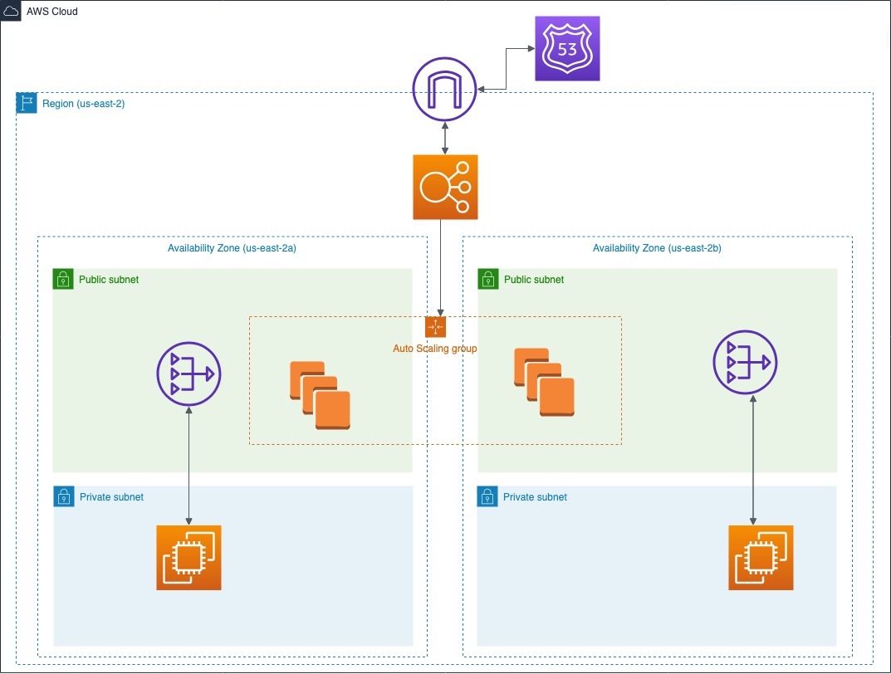

# AWS Terraform Architecture

Practice creating AWS architecture in terraform

## Diagram

## Instructions

- Create Ssh keys whit the name: class_key

## Commands
`terraform init`
- Initializes a Terraform working directory, downloading the necessary providers and modules.
`terraform plan`
- Creates an execution plan that shows the changes that will be applied to the infrastructure, without actually making the changes.
`terraform apply`
- Applies defined changes to Terraform configuration files, creating, updating, or deleting resources as necessary.
`terraform destroy`
- Destroys all Terraform-managed resources in the working directory, deleting the created infrastructure.
`terraform validate`
- Checks the syntax and validity of Terraform configuration files.
`terraform show`
- Displays a human-readable representation of the current state of the managed infrastructure.
`terraform state`
- Interacts with Terraform state, allowing direct manipulation of state or display of detailed information.
`terraform refresh`
- Updates the Terraform state to reflect the current resources in the infrastructure.
`terraform output`
- Displays the output values defined in the Terraform configuration file.
## Create By
- David Arevalo

